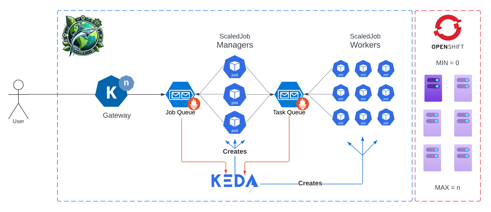

# Introduction 
This is a HPC Framework built by Ortec Finance that works natively on kubernetes.

Sailfish uses two RedHat supported operators to function: an AMQ Broker to capture the jobs and work items, and KEDA, an autoscaler that listens to these queues and matches the amount of containers deployed to process the jobs and work items. This project also uses Knative to submit the initial job to the queue and Prometheus to communicate Queue sizes for KEDA to trigger on.

This enables Sailfish to complete distributed computations on container level, leveraging the Public Cloud providers flexbility on provisioning Virtual Machines.  

# Videos
Demo with Azure Red Hat Openshift:
>

Lightning Talk at Kubernetes HPC Day 2023 Amsterdam:
>

Demo with Scaling the Message Queue infrastructure to zero
>

# Getting Started
To get started, **head over to `sailfish-k8s` README.md** and start with configuring your Sailfish instance

After that, you must modify your code base to listen to the AMQ Brokers message queues, to find inspiration on how to do so, checkout the `sailfish-c#` folder.

If you wish to just spin up Sailfish, a python demo app is included in the repository in `sailfish-py`. The `sailfish-k8s` overlay is already preconfigured to work on the applications in `sailfish-py`.

# Build and Test
You may simply `oc apply` to your namespaces on a kubernetes Cluster to deploy Sailfish, also follow the Prerequiste paragraph in the `sailfish-k8s` README to setup your cluster with the proper configuration.

The demo `sailfish-py` is stored in DockerHub, the dockerfiles are in the same folder if you wish to rebuild and push the Run manager and Runner Images to your image registry! Changes to the image will be picked up immediately with newly created Jobs.

# Architecture

